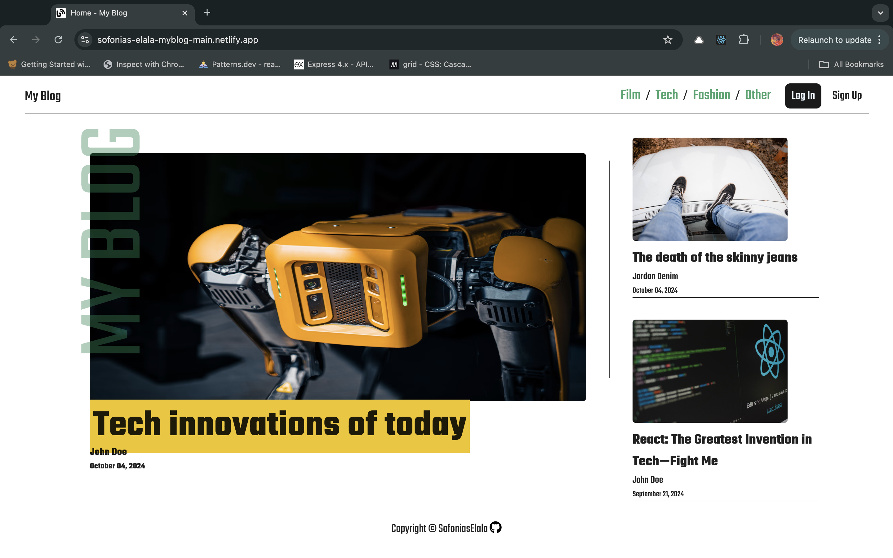
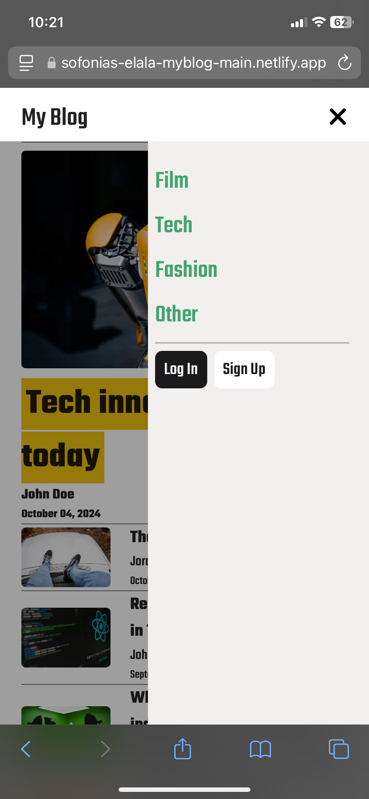
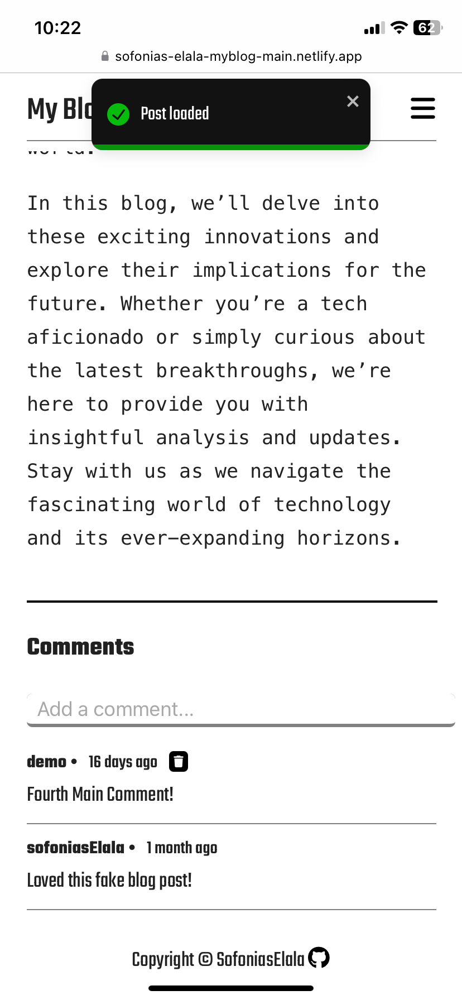
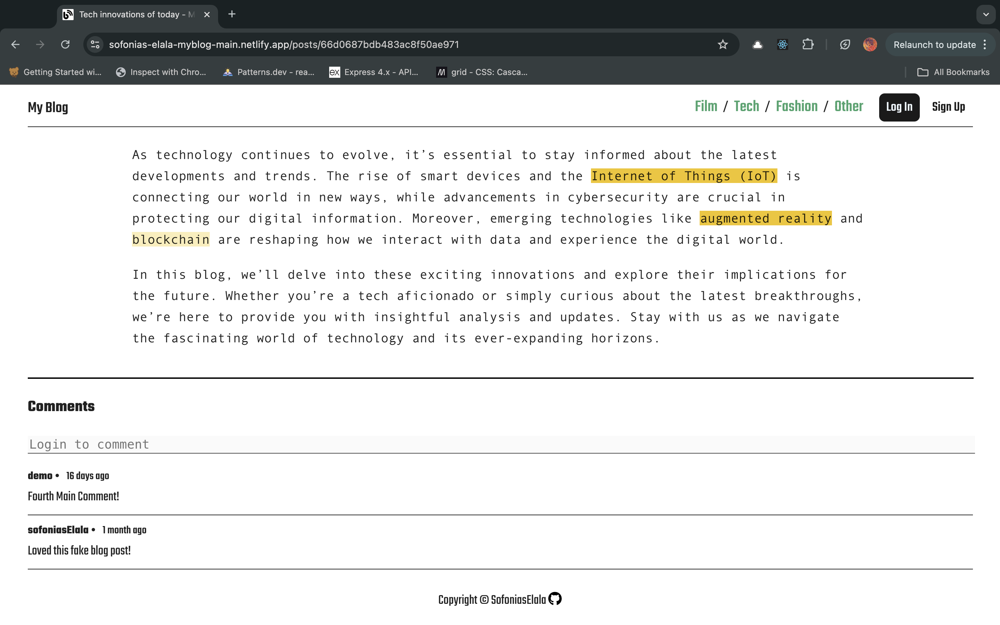

# My Blog - Main Site

 

## Description
#### ***My Blog*** is a full-stack web application where you can explore blog posts on topics like tech, film, fashion, and more. Anyone can browse and read the content, but you’ll need to create an account to join the conversation by leaving comments. Signing up is quick and easy, and once you’re in, you can write and delete your own comments on any post.
#### If you don't want to create an account but want to test the writing and deleting comments feature, the login page is pre-filled in with a demo account for you to utilize. all you have to do is click login!

## Links to the other ***My Blog*** repos
 * 
 * 

## Potential future features
 * the ability to search for blog posts
 * aria-label for accessability

## Screenshots
 

&nbsp;&nbsp;&nbsp;&nbsp;&nbsp;&nbsp;&nbsp;&nbsp;&nbsp;
 
&nbsp;&nbsp;&nbsp;&nbsp;&nbsp;&nbsp;&nbsp;&nbsp;&nbsp;

## Technologies Used:
* REACT + Vite
* HTML5
* CSS3
* version control with Git/GitHub
* Hosting on Netlify

## Dependencies
* REACT + Vite
* React router for client side routing
* Toastify for the toast notifications
* eslint